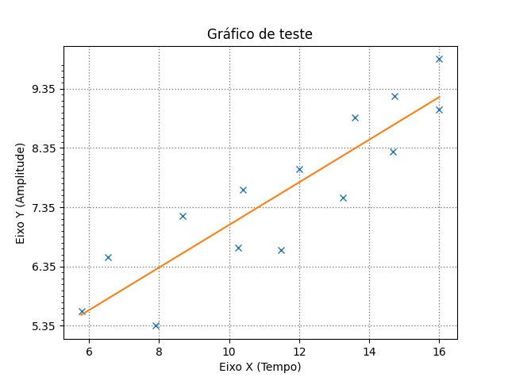
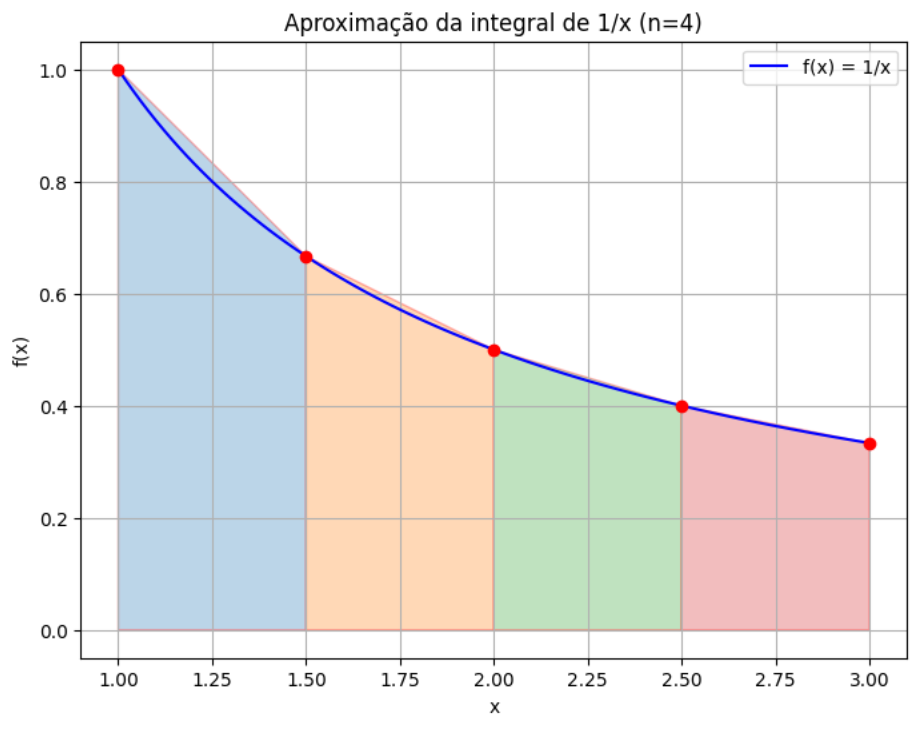

# Nome a ser definido

## Sobre
Este é o futuro projeto da disciplina de cálculo numérico que irá tratar de temas do meio ambiente

## Configuração

### Requisitos
Precisa ter o `python` com o pacote `venv` instalado. Além disso é preciso instalar o `pip`.

### Setup
Primeiro, crie o ambiente virtual:

```sh
python -m venv venv
```

Depois, entre no ambiente virtual:

```sh
source venv/bin/activate
```

Em seguida, instale as dependências usando o `pip`

```sh
pip install -r requirements.txt
```

## Executando

Tenha um arquivo de dados no formato `.csv`. Seu arquivo deve possuir duas colunas.
A primeira linha do arquivo será ignorada, recomenda-se que você use essa linha para documentar
o que representa cada coluna.

Abaixo se encontra um exemplo de como seu arquivo deve estar formatado:

```
x,y
1,2
3,4
5,6
```

Tendo o arquivo, basta executar:

```sh
python src/main_linear.py seu_arquivo.csv
```

### Exemplo
Usando o arquivo `data/example.csv` deve-se obter este resultado ao executar o script:

<div align="center">
    
</div>

### Visualizando o método do trapézio

A função `plota_trapezoids_grafico` plota o gráfico e os trapézio utilizados na função, dessa forma conseguimos visualizar o funcionamento do método.
<div align="center">
    
</div>
